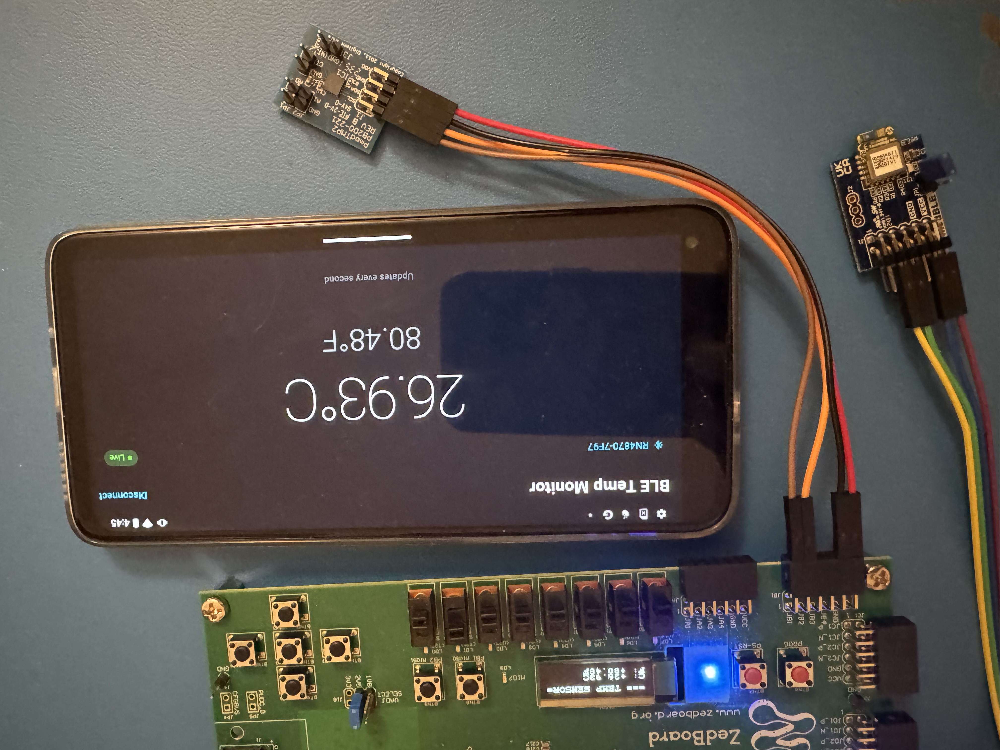
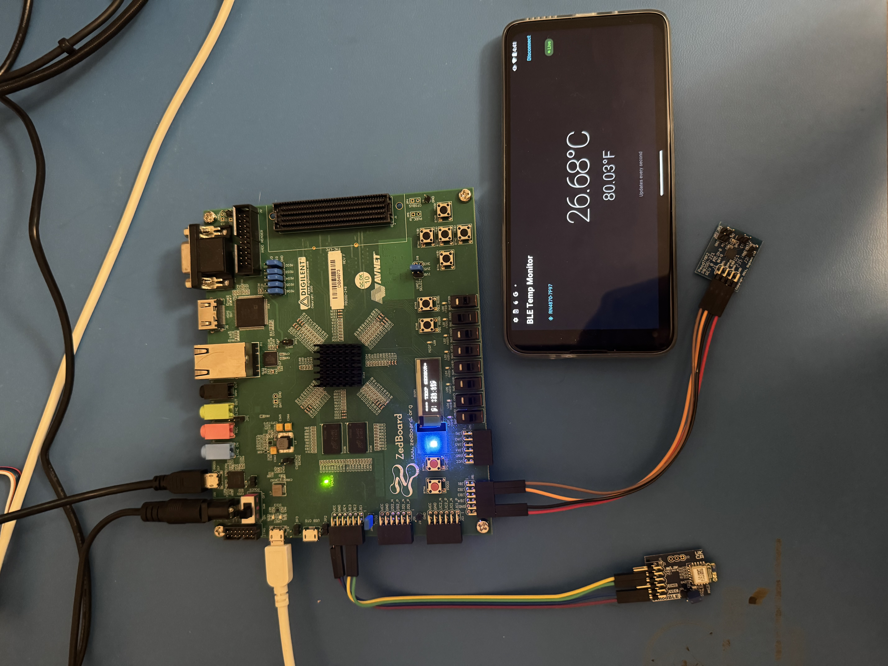
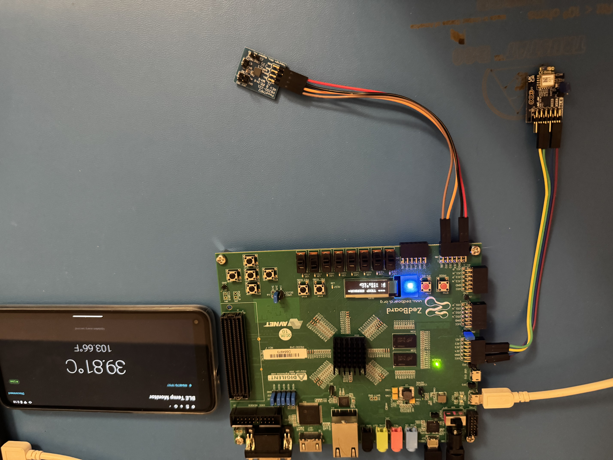

# ZedBoard-APP-BLE-OLED-TMP2

**Engineer:** Ava Kirkland — Nspired Engineering  
**Status:** 
- V1 Complete — validated on Android and iOS
- V2 Complete — Average Temperature reading sent and new OLED IP with toggle off/on implementation used
- V2.1 Current —  validated on Android and iOS, OLED IP updated and bug fix in main.c
- There is a Two Phone System Version: [ZedBoard-APP-DualBLE-OLED-TMP2](https://github.com/Ava-Kirkland/ZedBoard-APP-DualBLE-OLED-TMP2)
  
A ZedBoard (Zynq-7000) reads temperature from a Pmod TMP2 (ADT7420) over I2C, displays it on the onboard OLED via a custom AXI-Lite IP (`oledAddition_v4.0`), and streams live readings to a Flutter mobile app over Bluetooth Low Energy via a Pmod BLE (RN4871). The phone app displays °C and °F simultaneously, updating at approximately 1Hz. Temperature is sampled 5 times per second using non-blocking polling; the average of 5 valid readings is sent to all outputs. The OLED turns off on BLE disconnect and turns back on when the phone reconnects.

---

## Results

|  |
|---|
|  The System at the Temperature of the Room |
|  The System after having a Hair Dryer blowing hot air on the Temperature System for a few seconds |

---

## Running

> After setting up Vivado and exporting hardware  
> Making a workspace for Vitis and building the platform connected to the `.xsa`, and an application connected to the platform  
> The BLE app is built/copied and verified that it opens on an Android or iOS Phone  
> Hardware of ZedBoard and peripherals are set up

1. Turn on the ZedBoard
2. Connect to Tera Term (115200 — ZedBoard UART)
3. Run the Vitis application
4. Run BLE App on Phone
5. Connect App to ZedBoard by pressing Connect

---

## Table of Contents

| File | Description | Status |
|------|-------------|--------|
| [docs/01_hardware_and_vivado.md](docs/01_hardware_and_vivado.md) | Hardware overview, Vivado block design, pin constraints | ✅ |
| [docs/02_vitis_setup.md](docs/02_vitis_setup.md) | Vitis workspace, BSP config, hardware hookup, observed results | ✅ |
| [docs/03_vitis_firmware.md](docs/03_vitis_firmware.md) | Bare-metal C firmware — sampling loop, OLED toggle, BLE protocol, UART parsing | ✅ |
| [docs/04_ble_protocol.md](docs/04_ble_protocol.md) | Full protocol spec — UUIDs, commands, packet format | ✅ |
| [docs/05_flutter_app.md](docs/05_flutter_app.md) | Flutter app — architecture, state machine, BLE connection flow | ✅ |
| [docs/06_android_setup.md](docs/06_android_setup.md) | Android environment setup and permissions | ✅ |
| [docs/07_ios_setup.md](docs/07_ios_setup.md) | iOS environment setup on macOS — Flutter PATH, Xcode signing | ✅ |
| [docs/bugs_and_fixes.md](docs/bugs_and_fixes.md) | Every bug encountered — symptom, root cause, fix, lesson | ✅ |
| [docs/tool_version_differences.md](docs/tool_version_differences.md) | Vitis 2025.2 and flutter_blue_plus 2.3.10 differences from docs | ✅ |
| [docs/troubleshooting.md](docs/troubleshooting.md) | Quick-reference — error message → cause → fix | ✅ |

---

## System Architecture

```
┌──────────────────────────────────────────────────────┐
│                   ZedBoard (Zynq-7000)               │
│                                                      │
│  ┌──────────┐   AXI-Lite  ┌──────────────────────┐   │
│  │  PS ARM  │────────────►│ oledAddition_v4.0 IP │   │
│  │  (main.c)│             │  (PL) reg0–reg3      │──► Onboard OLED
│  │          │             └──────────────────────┘   │
│  │          │    I2C      ┌──────────┐               │
│  │          │◄───────────►│ ADT7420  │ Pmod TMP2     │
│  │          │             └──────────┘               │
│  │          │   UART0     ┌──────────┐               │
│  │          │◄───────────►│  RN4871  │ Pmod BLE      │
│  └──────────┘             └──────────┘               │
└──────────────────────────────────────────────────────┘
                               │ BLE (Transparent UART)
                    ┌──────────▼───────────┐
                    │   Flutter App        │
                    │   Android / iOS      │
                    │                      │
                    │  Scan → Connect →    │
                    │  Subscribe → Stream  │
                    └──────────────────────┘
```

**Data flow:**

1. ADT7420 is sampled 5 times per second using non-blocking polling (one read every 200ms). Bad reads (sentinel values) are skipped. Once 5 valid readings are accumulated, the average is computed.
2. Firmware decomposes the average into `TempParts` once — OLED, Tera Term, and BLE all format from the same struct, eliminating rounding divergence.
3. While streaming, firmware sends `TEMP:23.56C,74.41F\r\n` over UART0 to the RN4871.
4. RN4871 transmits over BLE Transparent UART Service.
5. Flutter app buffers incoming bytes, parses complete `\r\n`-terminated lines, updates display.
6. On `%DISCONNECT%` from the RN4871, the OLED powers off (`oledAddition_v4.0` power-off sequence). On the next `%STREAM_OPEN%`, the OLED powers back on and resumes displaying temperature.

---

## Firmware Source Files

| File | Role |
|------|------|
| `main.c` | Top-level loop — sampling, averaging, UART parsing, OLED toggle |
| `adt7420.c/.h` | ADT7420 I2C driver — init, read, decompose, print |
| `oled.c/.h` | OLED AXI driver — init, write, clear, power off/on |
| `ble_uart.c/.h` | UART init for UART0 (BLE) and UART1 (Tera Term) |
| `temp_display.c/.h` | Integration layer — formats `TempParts` and writes to OLED |

## PL Source Files (oledAddition_v4.0 IP)

| File | Role |
|------|------|
| `oledControlp4.v` | Top-level AXI-Lite IP wrapper |
| `oledControlp4_slave_lite_v2_0_S00_AXI.v` | AXI slave — register interface, instantiates `top` |
| `top.v` | Structural wrapper connecting AXI slave to `oledControl` |
| `oledControl.v` | OLED FSM — init, send, power-off, power-on sequences |
| `spiController.v` | SPI bit-bang engine |
| `delayGen.v` | 2ms delay generator (used during init) |
| `charROM.v` | ASCII character bitmap ROM |

> `delayGenPowerOff.v` (100ms delay for power-off tOFF) is part of the IP but not listed separately — instantiated inside `oledControl.v`.

---

## Development Notes

> Vivado and Vitis projects are developed on Windows and live in the `vivado/` and `vitis/` folders of this repo. The Mac clone of this repo exists solely for iOS Flutter builds — no hardware development happens on the Mac.

---

## Related Projects

This project builds on a series of standalone ZedBoard projects. Work through them in order if starting from scratch — each one validates a component in isolation before it is combined here.

| Project | Description | Link |
|---------|-------------|------|
| ZedBoard OLED | Onboard OLED with custom AXI-Lite IP | [ZedBoard-OLED-Tutorial-Notes](https://github.com/Ava-Kirkland/ZedBoard-OLED-Tutorial-Notes) |
| ZedBoard OLED Addition | Power-off/on extension to the OLED IP, used in this project | [ZedBoard-OLED-Addition](https://github.com/Ava-Kirkland/ZedBoard-OLED-Addition) |
| ZedBoard Pmod TMP2 | ADT7420 temperature sensor over I2C | [ZedBoard-Pmod-TMP2](https://github.com/Ava-Kirkland/Zedboard-Pmod-TMP2) |
| ZedBoard Pmod BLE | RN4871 UART bridge | [ZedBoard-BLE](https://github.com/Ava-Kirkland/ZedBoard-BLE) |
| ZedBoard OLED + TMP2 | Combined OLED display with live temperature | [ZedBoard-OLED-TMP2](https://github.com/Ava-Kirkland/ZedBoard-OLED-TMP2) |
| **ZedBoard APP BLE OLED TMP2** | **This project — adds Flutter app over BLE** | — |
| ZedBoard AXI UARTLite | POC of AXI UARTLite sending a message through a Pmod BLE to a phone | [ZedBoard-AXI-UARTLite](https://github.com/Ava-Kirkland/ZedBoard-AXI-UARTLite) |
| ZedBoard APP DualBLE OLED TMP2 | Dual BLE, Android + iOS simultaneously | [ZedBoard-APP-DualBLE-OLED-TMP2](https://github.com/Ava-Kirkland/ZedBoard-APP-DualBLE-OLED-TMP2) |
---

## Key Tips — Read Before Starting

These are the things that cost the most time to find. Check them before you assume something is broken.

1. **`standalone_stdout` defaults to UART0 in Vitis — change it once in the BSP settings.**  
   Set both `standalone_stdin` and `standalone_stdout` to `ps7_uart_1`. This is a one-time change. Forgetting it routes `xil_printf` to the BLE module instead of Tera Term.

2. **The OLED IP used here is `oledAddition_v4.0` — not the original tutorial OLED IP.**  
   Use `XPAR_OLEDADDITION_0_BASEADDR` as the base address macro. The IP adds a power register at offset `0x0C` (reg3): write `0x1` to power off, `0x2` to power on. Poll until reg3 clears before assuming the command was consumed.

3. **The temperature averaging loop is non-blocking — do not replace it with `sleep()` or a blocking read loop.**  
   The firmware samples once every `COUNTS_PER_SECOND / NUM_SAMPLES` ticks and accumulates. A blocking approach inside the sample loop prevents UART polling and breaks `$$$` CMD mode entry and `START_TEMP` processing.

4. **Bad I2C reads are skipped, not counted.**  
   Only readings above `ADT7420_SENTINEL_THRESHOLD` increment `acc_count`. The firmware waits until 5 *valid* readings accumulate before computing the average. A sustained sensor failure means no output — it does not send garbage.

5. **The RN4871 does not include its service UUID in its advertisement payload.**  
   UUID-based BLE scan filtering won't find it. Filter by device name (`RN4870` or `RN4871`). This is hardware-specific — most BLE peripherals do advertise their UUID.

6. **iOS BLE redirecting to Settings on every Connect tap is caused by missing `pod install`, not a permissions bug.**  
   Run `pod install` in `ios/` before the first iOS build. Without it, the BLE native libraries are not linked and the app misbehaves in ways that look like permission issues.

7. **Always open `Runner.xcworkspace`, never `Runner.xcodeproj` in Xcode.**  
   CocoaPods requires the workspace. The wrong file opens fine but BLE libraries won't be linked.

8. **CMD mode (`$$$`) on UART1 must gate all UART0 output.**  
   If UART0 is active during CMD mode, RN4871 interprets the output as commands and responds with `Err` spam. The firmware sets `cmd_mode = true` and stops all UART0 writes until `---` is received on UART1.

9. **`device.connect()` requires `license: License.nonprofit` in flutter_blue_plus 2.3.10.**  
   The parameter is not in older docs. Omitting it causes a compile error that looks unrelated.

---

## Possible Future Improvements

- C/F toggle — tap to switch primary display unit
- App icon and display name
- ProGuard rule for Android release build
- Auto-reconnect with exponential backoff
- `AppLifecycleState` handler for iOS BLE resume

---

## External References

- [flutter_blue_plus pub.dev](https://pub.dev/packages/flutter_blue_plus)
- [RN4871 User Guide (Microchip)](https://www.microchip.com/en-us/product/RN4871)
- [ADT7420 Datasheet (Analog Devices)](https://www.analog.com/en/products/adt7420.html)
- [Android Bluetooth Permissions (Android 12+)](https://developer.android.com/about/versions/12/features/bluetooth-permissions)
- [ZedBoard-OLED-Addition (power-off/on IP)](https://github.com/Ava-Kirkland/ZedBoard-OLED-Addition)
