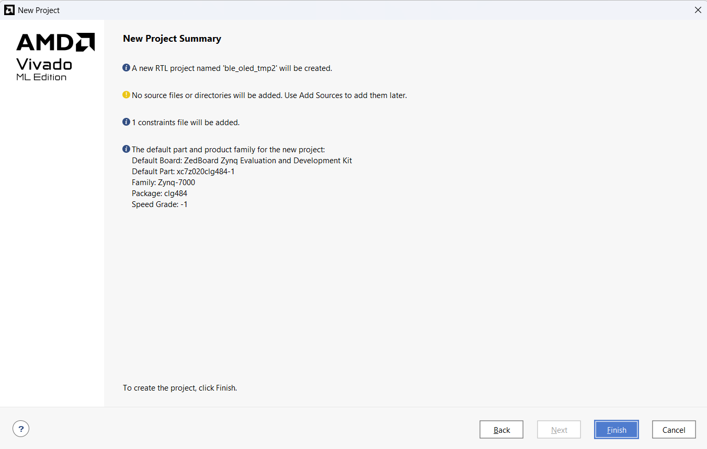
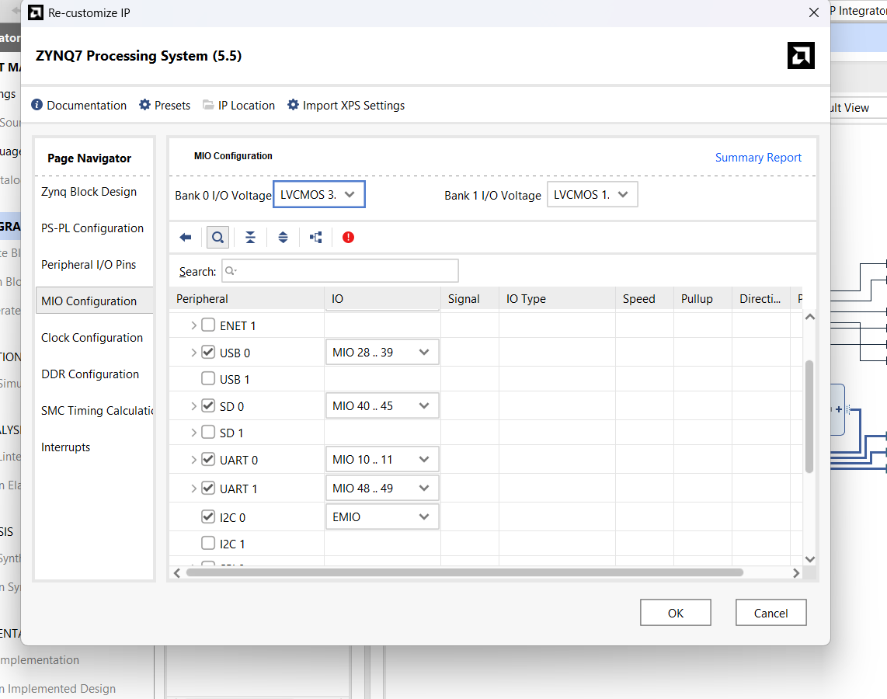
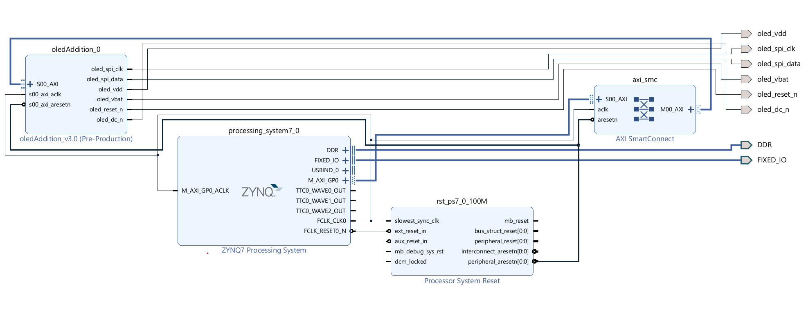
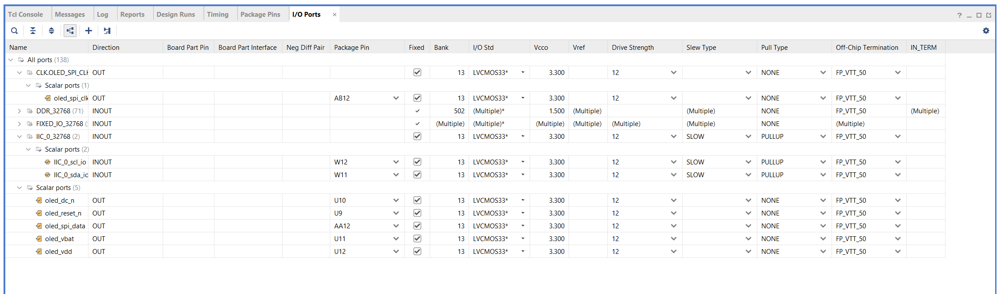

# 01 — Hardware and Vivado Setup

`Project: APP-BLE-OLED-TMP2 | Tools: Vivado 2025.2 | Board: ZedBoard (Zynq-7000)`

---

## Overview

This phase covers the physical hardware configuration and Vivado block design. The ZedBoard uses its ARM Processing System (PS) to communicate with two Pmod peripherals — TMP2 (temperature sensor, PS I2C routed via EMIO to the PL Pmod connector) and BLE (wireless module over UART) — and drives the onboard OLED via `oledAddition_v3.0`, a custom AXI-Lite IP in the PL. All peripheral logic runs on the PS; EMIO is used purely as a pin routing path for the TMP2.

---

## Hardware

| Component | Interface | Role |
|-----------|-----------|------|
| ZedBoard (Zynq-7000) | — | Main processing board |
| Pmod TMP2 (ADT7420) | I2C via EMIO (PS) | Temperature sensor |
| Onboard OLED | Custom AXI-Lite IP (PL) — `oledAddition_v3.0` | Local display with software power toggle |
| Pmod BLE (RN4871) | UART (PS) | Bluetooth Low Energy module |

### Notes

- The OLED is the ZedBoard's onboard display — not a Pmod peripheral
- The OLED IP used in this project is `oledAddition_v3.0` from [ZedBoard-OLED-Addition](https://github.com/Ava-Kirkland/ZedBoard-OLED-Addition) — it is a drop-in replacement for the original tutorial OLED IP, adding a power-off/power-on register (reg3, offset `0x0C`)
- All Pmod BLE pins are bank 13 (3.3V) — use `LVCMOS33` in the XDC constraints file
- The RN4871 UART is connected to UART0 (`ps7_uart_0`) on the ZedBoard
- UART1 (`ps7_uart_1`) is used for Tera Term debug output (USB-UART on the ZedBoard)

---

## Key Concepts

**PS (Processing System):** The ARM Cortex-A9 hard processor on the Zynq. Handles all firmware logic. No custom RTL is written for this project — the PL hosts only the `oledAddition_v3.0` IP.

**MIO (Multiplexed I/O):** Fixed PS pins hardcoded to specific physical pins on the Zynq. UART0 (BLE) and UART1 (Tera Term) both use MIO. MIO peripherals do not appear in the Vivado block design diagram or the I/O Ports tab — they are routed in silicon.

**EMIO (Extended MIO):** Routes PS peripherals out through the PL fabric to reach PL-side Pmod connectors. I2C 0 for the TMP2 uses EMIO. EMIO pins do appear in the block design and constraints file.

**UART0 vs UART1:** UART0 (`ps7_uart_0`) is the BLE channel — MIO 10..11, Pmod JE. UART1 (`ps7_uart_1`) is the debug channel — Tera Term via the ZedBoard USB-UART.

**`oledAddition_v3.0` IP register map:**

| Offset | Register | Direction | Function |
|--------|----------|-----------|----------|
| `0x00` | reg0 — control | PS writes | Write `0x1` to trigger character send; hardware clears on `sendDone` |
| `0x04` | reg1 — status | Hardware writes | Set to `1` by hardware when send complete; PS clears |
| `0x08` | reg2 — data | PS writes | Character byte to send |
| `0x0C` | reg3 — power | PS writes | Write `0x1` for power-off, `0x2` for power-on; hardware clears on `powerCmdAck` |

---

## Vivado Setup

> **Shortcut:** This project can be started from the existing OLED + TMP2 Vivado project. The only changes to the block design are: replacing the original OLED IP with `oledAddition_v3.0`, and enabling UART0 in the Zynq PS. The steps below assume a new project.

### 1. Create Project

- Select **RTL Project**
- Board: ZedBoard
- Add the OLED + TMP2 project's constraints file — it already contains the correct entries for the OLED and TMP2 pins

### 2. Create Block Design

Build the block design with the same OLED and TMP2 capabilities as the OLED + TMP2 project:

- Add the Zynq7 Processing System IP
- Add `oledAddition_v3.0` (the custom OLED AXI-Lite IP with power toggle), connected via AXI Interconnect
- Enable EMIO access for I2C 0 (for TMP2)
- Remove the `_0` suffix from any external ports created by Vivado so that the names match the constraints file exactly

> **Use `oledAddition_v3.0`, not the original OLED IP.** The AXI interface is identical but `oledAddition_v3.0` adds reg3 for power control. The base address macro in software must be `XPAR_OLEDADDITION_0_BASEADDR`.

### 3. Enable UART0 — New Step for This Project

In the Zynq7 Processing System block:

**ZYNQ7 Processing System → MIO Configuration → I/O Peripherals → enable UART 0 → MIO 10..11**

> MIO 10..11 maps to the **JE Pmod connector** on the ZedBoard. JE is the one Pmod connector that connects directly to the PS-side MIO pins — this is why the Pmod BLE must go on JE specifically.

### 4. Validate and Save Block Design

Run **Validate Design**. The block design tab will look identical to the OLED + TMP2 block design.

> This is expected — UART0 uses hardcoded MIO pins and does not appear as a port in the block design diagram.

### 5. Create HDL Wrapper

Right-click the block design in the Sources panel → **Create HDL Wrapper** → let Vivado manage it.

### 6. Run Synthesis

After synthesis completes, open the synthesized design and check:

- **Constraints file** — verify OLED and TMP2 pin entries are correct
- **I/O Ports tab** — verify pin assignments

> There will be no UART0 entry in the I/O Ports tab. This is correct — MIO pins are hardcoded to the silicon and do not go through the PL.

### 7. Implement and Export

1. Run Implementation
2. Generate Bitstream
3. **File → Export Hardware → Include Bitstream**

The exported `.xsa` is used to create the Vitis platform.

---

## Next Step

See [02_vitis_setup.md](02_vitis_setup.md) for Vitis workspace setup, BSP configuration, hardware hookup, and observed results.