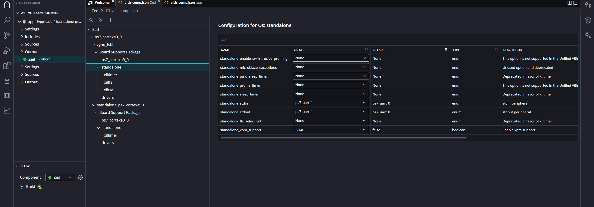
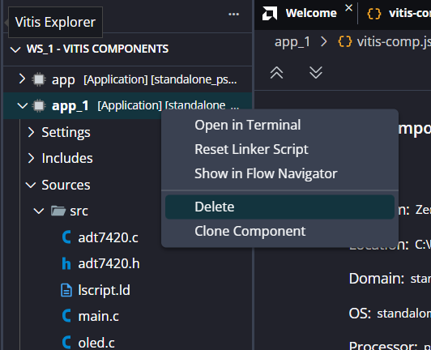
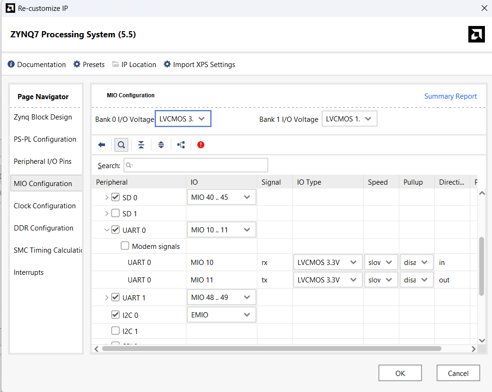
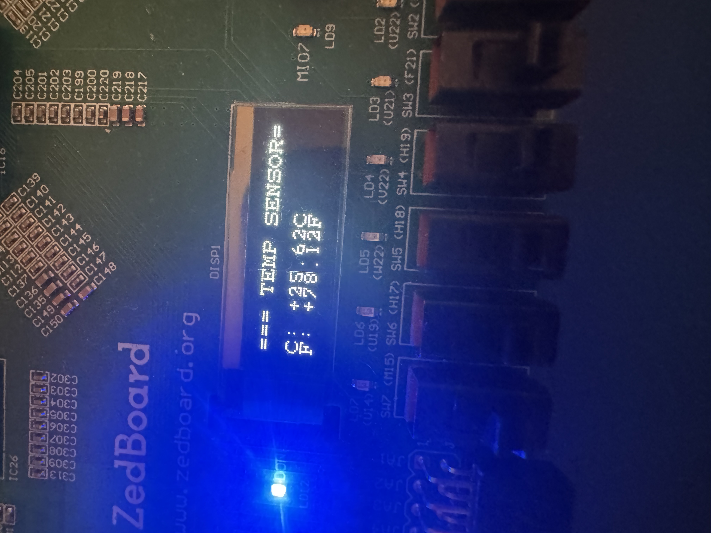
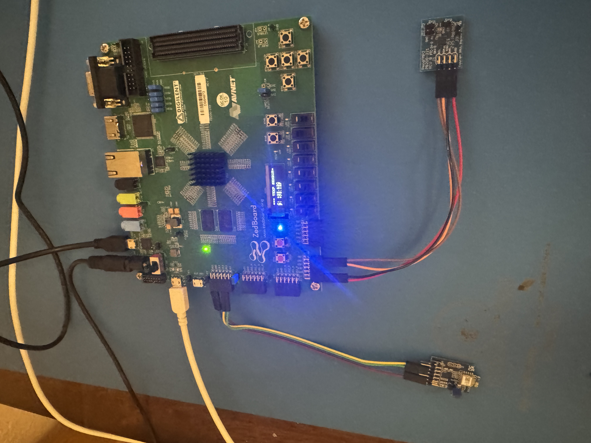

# 02 — Vitis Setup

`Project: APP-LE-OLED-TMP2 | Tools: Vitis 2025.2`

---

## Overview

This phase covers creating the Vitis workspace, configuring the BSP, building the application, and running it on the ZedBoard. The `.xsa` exported from Vivado is the starting point.

---

## Setup Steps

### 1. Create Workspace and Platform

Set workspace to `ws/` (or `ws_1/` — see Bug #12 below).

Create a **Platform** connected to the `.xsa` exported from Vivado. Build the platform.

### 2. Configure BSP — standalone_stdin/stdout (Do This Before Building)

> **Do this before building the platform for the first time.** With UART0 enabled in the hardware, Vitis auto-assigns `standalone_stdin` and `standalone_stdout` to `ps7_uart_0` (the BLE module). This must be changed to `ps7_uart_1` (Tera Term).

Set in **both** of these locations in the Vitis Explorer:

- `{platform}` → `ps7_cortexa9_0` → `zynq_fsbl` → Board Support Package → standalone
- `{platform}` → `ps7_cortexa9_0` → `standalone_ps7_cortexa9_0` → Board Support Package → standalone

In each: set `standalone_stdin` and `standalone_stdout` to `ps7_uart_1`.

### 3. Build Platform

Build the platform after configuring BSP settings.

### 4. Create Application

Create an application linked to the platform. Configure build settings to build application only (not platform) and set for workspace scope.

Build the application once before adding source files.

### 5. Add Source Files — Reset Linker Script Before First Build

Add all `.c` and `.h` source files to `src/`.

> **Before building for the first time:** right-click the application in the Vitis Explorer → **Reset Linker Script**. Without this step, the build fails with `lscript_a9.ld.in does not exist`. See Bug #13.

Reference: [AMD Vitis Linker Script Documentation](https://docs.amd.com/r/en-US/ug1400-vitis-embedded/Linker-Scripts?tocId=nelEb6zIWCPFFjsSi9EysA)

### 6. Build Application

Build the application. If a multiple definition linker error appears, a stale `.c` file is still in `src/` — remove it and rebuild. See Bug #14.

### 7. Run Configuration

In **Run Configurations** for the application, set **Board Initialization** to **FSBL**.

---

## Hardware Setup

Connect peripherals before running:

- **Pmod TMP2** → Pmod JB
- **Pmod BLE (RN4871)** → Pmod JE

**UART crossover — required:**

| Pmod BLE Pin | Connects to | ZedBoard JE Pin | MIO |
|---|---|---|---|
| TX | → | JE2 | RX (MIO 11) |
| RX | → | JE3 | TX (MIO 10) |

> TX and RX must be crossed. Pmod TX goes to ZedBoard RX and vice versa.

Power on the ZedBoard. The Pmod BLE power LED should blink — this confirms the RN4871 is advertising.

**Tera Term setup:** 115200 baud.

---

## Observed Results

> **The ZedBoard must be powered on and the application running before attempting to connect the Flutter app.** The Pmod BLE must also be set up and advertising — see [ZedBoard-BLE](https://github.com/Ava-Kirkland/ZedBoard-BLE) for Pmod BLE setup. The power LED blinking confirms the RN4871 is advertising and ready.

With correct Vivado hardware and Vitis BSP configuration:
- Tera Term receives `xil_printf` output on UART1
- OLED initializes and displays temperature
- Pmod BLE power LED blinks — RN4871 advertising
- nRF Connect on iPhone can discover and connect to the RN4871 — advertises as `RN4870-7F97` or your Pmod BLE's name. Once connected, write `53 54 41 52 54 5F 54 45 4D 50 0D 0A` (`START_TEMP\r\n`) in hex to the RX characteristic and the ZedBoard will respond with temperature readings at 1Hz. With the Flutter app, connecting is enough — the app sends `START_TEMP` automatically.

> The ZedBoard with Pmod TMP2 on JB and Pmod BLE on JE is shown above.

---

## Debug Notes

- Bug #12: Corrupted `ws/` workspace → created `ws_1/` → see [bugs_and_fixes.md](bugs_and_fixes.md#bug-12--corrupted-vitis-workspace)
- Bug #13: `lscript_a9.ld.in does not exist` → Reset Linker Script → see [bugs_and_fixes.md](bugs_and_fixes.md#bug-13--lscript_a9ldin-does-not-exist)
- Bug #14: Multiple definition linker errors → stale `.c` file in `src/` → see [bugs_and_fixes.md](bugs_and_fixes.md#bug-14--multiple-definition-linker-errors)
